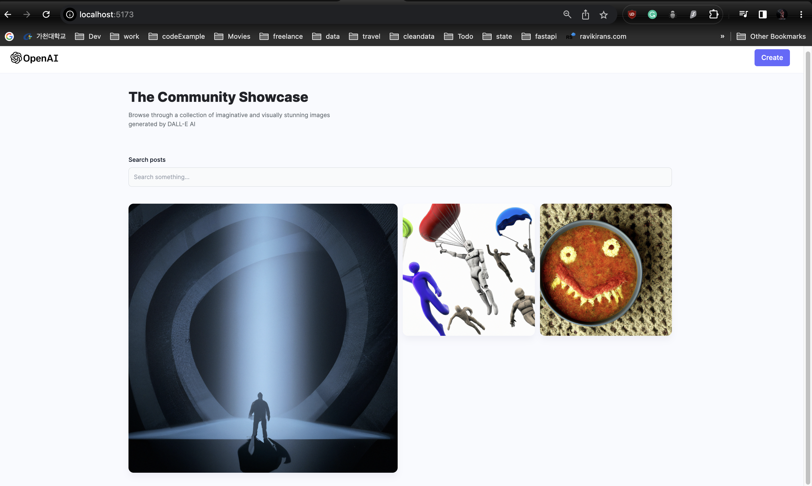

# MERN AI Image Generation ` DALL-E 2.0`.

This application is an AI image generation for DALL-E where prompts are used to generate images from text using OpenAI
## Client
- The client creates images uses different prompts and an image is generated.
- The client uses tailwind, react and react-router-dom.
- There are two page for landing and creation.

## Server
- Cloudinary used to storage images for the project in the backend.
- Connection to mongoDB with mongoose in a `connect.js file`.
- Mongo Atlas to create a database for DALL-E.
### Service providers
- OpenAI for API keys
- Cloudinary for image storage: Provide a PhotoUrl as post
- MongoDB for the database.
- Render to host our Backend server.