# MERN AI Image Generation ` DALL-E 2.0`.
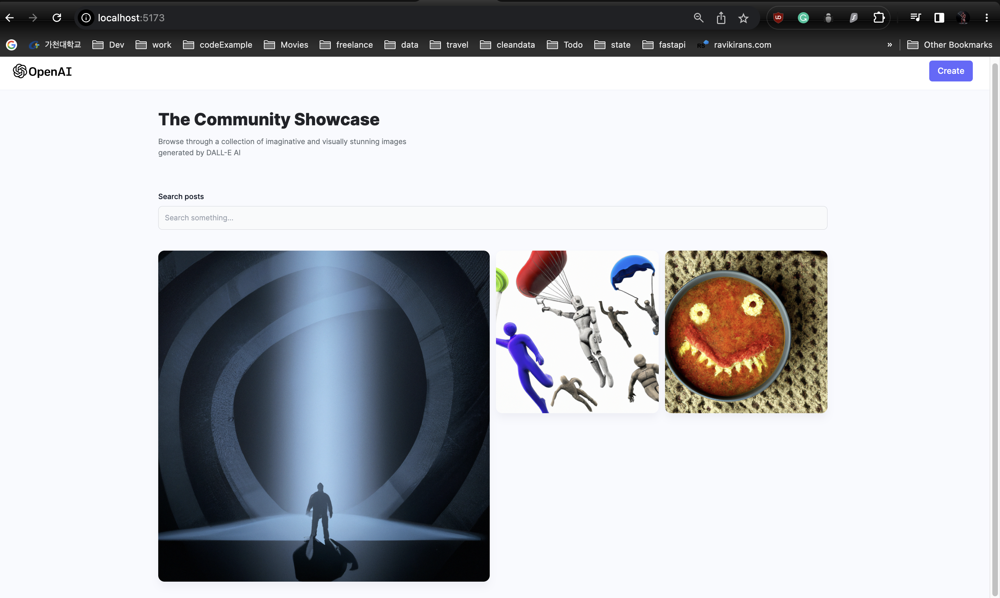
This application is an AI image generation for DALL-E where prompts are used to generate images from text using OpenAI
## Client
- The client creates images uses different prompts and an image is generated.
- The client uses tailwind, react and react-router-dom.
- There are two page for landing and creation.

## Server
- Cloudinary used to storage images for the project in the backend.
- Connection to mongoDB with mongoose in a `connect.js file`.
- Mongo Atlas to create a database for DALL-E.

## Service providers
- ### OpenAI for API keys
  - **URL**
    ```
     https://platform.openai.com
    ```
  - **ID(Login with Google)**
    ```
    zipshowkorea3@gmail.com
    ```
  - **Access Key List**\
    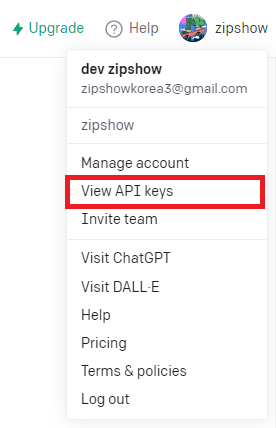\
    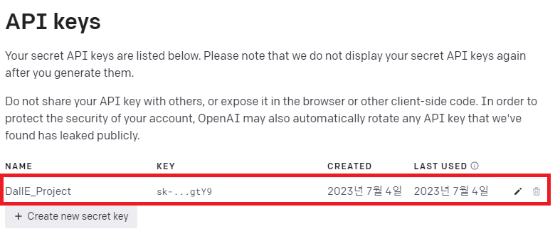
    
- ### Cloudinary for image storage: Provide a PhotoUrl as post
  - **URL**
    ```
    https://cloudinary.com
    ```
  - **ID(Login with Google)**
    ```
    zipshowkorea3@gmail.com
    ```
  - **Configuration**
    - Cloud Name\
      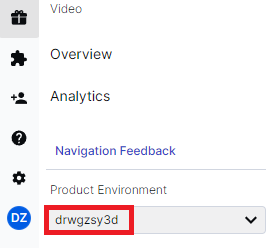\
      *Left bottom corner*
    - API Key & Secret\
      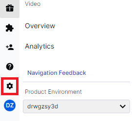\
      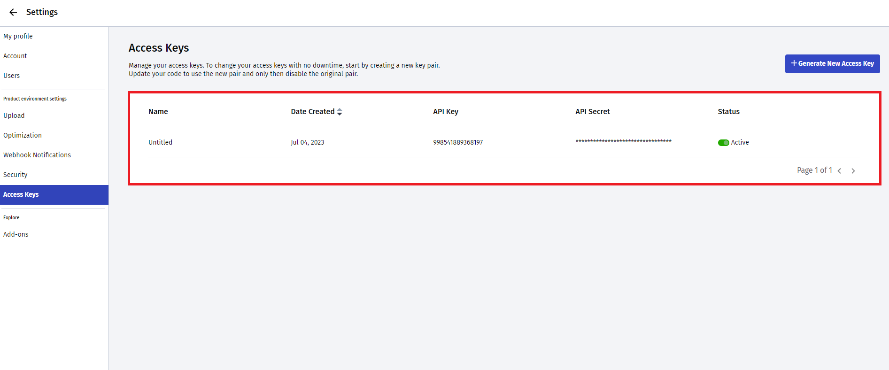
- ### MongoDB for the database
  - **URL**
    ```
    https://account.mongodb.com/account/login
    ```
  - **ID(Login with Google)**
    ```
    zipshowkorea1@gmail.com
    ```
  - **Connection**\
    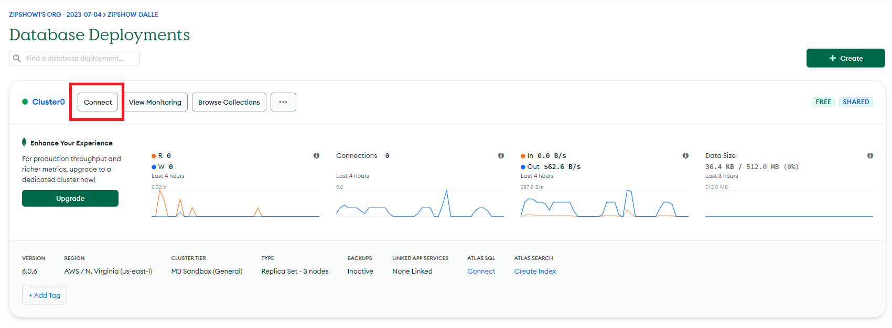\
    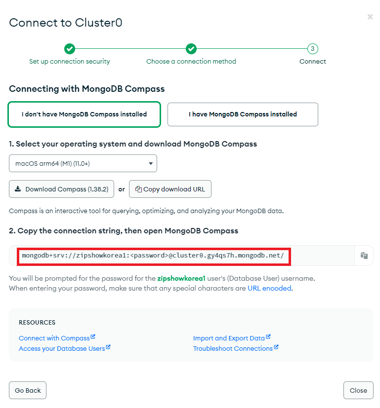
- ### Render to host our Backend server
  - **URL**
    ```
    https://render.com/
    ```
  - **ID(Login with GitHub)**
    ```
    zipshowkorea
    ```
  - **Dashboard(Servers)**\
    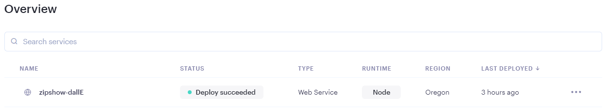
  - **Configuration**\
    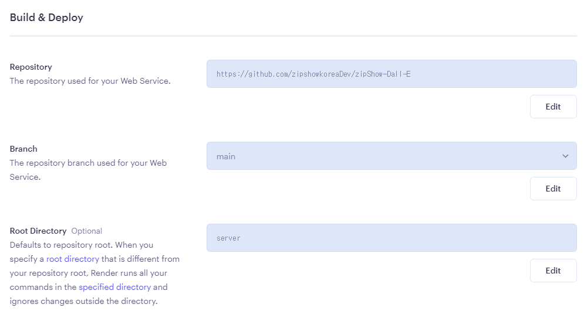\
    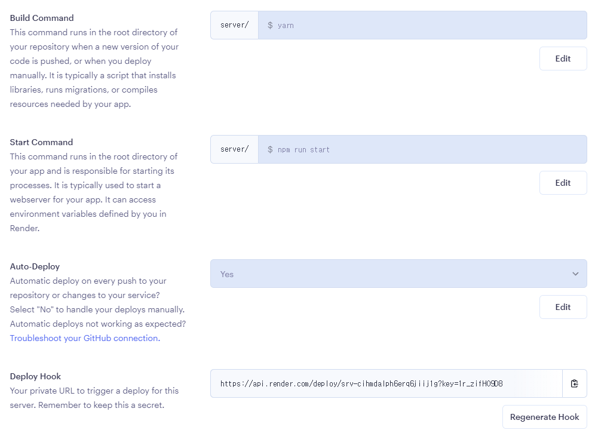\
    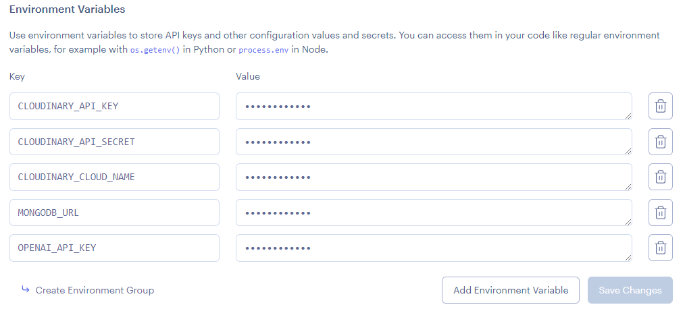\
    *Environment Variables are in the `.env` file*
    ```
    # Environment Variables(.env)
    
    CLOUDINARY_API_KEY=""
    CLOUDINARY_API_SECRET=""
    CLOUDINARY_CLOUD_NAME=""
    MONGODB_URL=""
    OPENAI_API_KEY=""
    ```